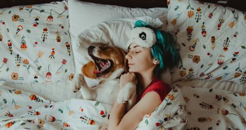
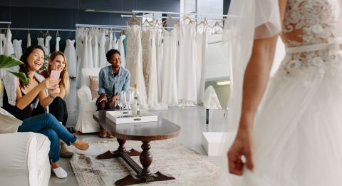
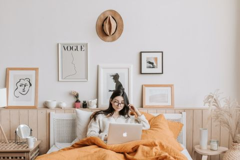
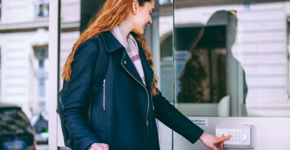
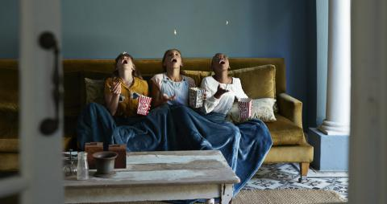

# some_2003027_march_992x525.jpg

The main subject:
The main subjects of the image are a person and a dog. The person is lying in bed, cuddling with the dog. The person has blue-green hair and is wearing a white sleep mask with a panda face design on it. The dog appears to be a medium-sized breed with a brown and white coat.

Setting or background:
The image is set in a bedroom. The bed is made with white sheets and a duvet cover that has a colorful, whimsical pattern featuring various small illustrations of plants, flowers, and possibly mushrooms. The background consists of pillows and the headboard of the bed, which is partially visible.

Colours:
The dominant colors in the image are white (from the bedding and the sleep mask), blue-green (from the person's hair), and various bright colors from the patterns on the bedding, including reds, yellows, and greens. The dog's brown and white fur also stands out.

Emotion:
The image conveys a sense of comfort, relaxation, and affection. The person and the dog appear to be peacefully sleeping or resting together, suggesting a close bond and a moment of tranquility.

Details:
- The person is wearing a red shirt.
- The sleep mask has a cute panda face design, adding a playful element to the image.
- The dog is lying on its back with its mouth open, possibly yawning or smiling, which adds to the relaxed and happy atmosphere.
- The bedding pattern is detailed and colorful, featuring various small illustrations that add a whimsical and cozy feel to the scene.
- The person has their arm around the dog, emphasizing the affectionate relationship between them.
--------------------------------------------------------------------
# trouw-190401.jpg

The main subject:
The main subject of the image is a woman trying on a wedding dress. She is positioned on the right side of the image, with her back partially turned towards the camera, showcasing the intricate details of the dress.

Setting or background:
The image is set in a bridal boutique or a wedding dress shop. The background features a variety of wedding dresses hanging on racks, indicating that this is a place where brides come to try on and select their wedding gowns. The setting is elegant and well-lit, with a modern and sophisticated ambiance.

Colours:
The dominant colors in the image are white and light tones. The wedding dresses are predominantly white, contributing to a clean and bright atmosphere. The furniture and decor in the boutique also feature neutral and light colors, such as white and beige, which complement the overall aesthetic.

Emotion:
The image conveys a sense of joy and excitement. The woman trying on the wedding dress is likely experiencing a significant and happy moment, as choosing a wedding dress is often a memorable part of wedding planning. Additionally, the three women seated on the left side of the image appear to be friends or family members, and they are smiling and taking photos, further emphasizing the celebratory and supportive atmosphere.

Details:
- The woman trying on the wedding dress is wearing a gown with intricate lace details and a flowing skirt.
- There is a coffee table in the center of the image with a few items on it, including a tray with glasses and a bottle, possibly champagne, suggesting a celebratory occasion.
- The three women seated on the left are sitting on comfortable white chairs and a sofa, indicating a cozy and inviting environment.
- One of the women is holding a smartphone and appears to be taking a photo or video of the bride-to-be, capturing the special moment.
- The boutique is well-organized, with dresses neatly arranged on racks and a clean, uncluttered space.
--------------------------------------------------------------------
# pexels-vlada-karpovich-4050387.jpg

The main subject of the image is a young woman sitting on a bed, working on a laptop. She appears to be focused and relaxed, suggesting a casual and comfortable atmosphere.

**Setting or Background:**
The image is set in a cozy bedroom. The background features a light-colored wall adorned with various framed artworks. The bed has a wooden headboard with a white rattan design, and there are several decorative items on a shelf behind the bed, including small potted plants and ceramic bowls.

**Colours:**
The dominant colors in the image are soft and neutral tones. The bedding is a warm, burnt orange color, which contrasts nicely with the white and beige tones of the walls and furniture. The artworks on the wall add subtle touches of black and white, contributing to a minimalist aesthetic.

**Emotion:**
The image conveys a sense of calm and comfort. The woman appears to be in a relaxed state, possibly enjoying a quiet moment of productivity or leisure. The warm colors and cozy setting enhance this feeling of tranquility.

**Details:**
- The woman is wearing glasses and a light-colored, cozy sweater.
- She is sitting up in bed with an orange duvet covering her legs.
- The laptop she is using is an Apple MacBook, identifiable by the logo.
- The wall art includes a framed print with the word "VOGUE," a minimalist line drawing of a face, and other abstract or silhouette artworks.
- A round, woven hat is hung on the wall above the bed, adding a touch of rustic charm.
- There is a small mirror and a few decorative items on the bedside table, including a candle and a vase with dried flowers.
- The overall decor is modern and minimalist, with a focus on comfort and style.
--------------------------------------------------------------------
# content_fb_festivalapps_3_aout.jpg

The main subject:
The main subjects of the image are three women who are the focal point. They are all wearing sunglasses and appear to be enjoying themselves as they look at a smartphone one of them is holding.

Setting or background:
The image is set outdoors, likely during a sunny day given the bright light and the sun flare visible in the background. The background is somewhat blurred, but it appears to be a lively setting, possibly a festival or a park, given the casual and festive attire of the women.

Colours:
The dominant colors in the image are warm and vibrant. There are shades of orange, yellow, and gold from the sunlight, as well as various colors from the women's clothing and accessories. The overall tone of the image is bright and cheerful.

Emotion:
The image conveys a sense of joy and camaraderie. The women are smiling and appear to be laughing, suggesting they are having a good time together. Their body language and facial expressions indicate happiness and excitement.

Details:
- All three women are wearing sunglasses, which adds to the sunny, outdoor vibe.
- They are dressed in casual, stylish clothing with accessories like earrings and hats.
- One woman is pointing at the smartphone, which suggests they are looking at something interesting or amusing on the screen.
- The sunlight creates a warm glow and highlights their hair and faces, enhancing the cheerful atmosphere.
- The image captures a candid moment of friendship and fun.
--------------------------------------------------------------------
# musique_streaming_992x515.png

The main subject: The main subjects of the image are three young women who appear to be enjoying a car ride. They are all inside a car, with one woman in the driver's seat, one in the front passenger seat, and one in the back seat.

Setting or background: The image is set inside a car. The background includes the car's interior, with visible seats and windows. Through the windows, some greenery and a blurred outdoor scene can be seen, suggesting that the car is moving through a scenic area.

Colours: The dominant colors in the image are earthy and natural tones. The interior of the car is mostly dark, with black or dark grey seats. The women's clothing features lighter colors, such as white, light green, and other pastel shades. The outdoor scenery visible through the windows adds some green hues to the image.

Emotion: The image conveys a sense of joy, relaxation, and camaraderie. The women are smiling and appear to be having a good time, suggesting a carefree and happy atmosphere.

Details: Specific details in the image include:
- The woman in the front passenger seat is wearing sunglasses, a striped shirt, and has a pair of headphones around her neck. She has her legs up on the dashboard, indicating a relaxed and casual posture.
- The woman in the driver's seat is wearing a light green off-the-shoulder top and has her hair tied back. She is smiling and looking at the road.
- The woman in the back seat is wearing a hat and appears to be looking at something in her hands, possibly a phone or a map.
- The car seats are equipped with seat belts, and the woman in the front passenger seat is wearing hers.
- The overall lighting in the image is bright and natural, suggesting it is daytime.
--------------------------------------------------------------------
# apps_juillet.png

The main subject:
The main subject of the image is a young woman who is looking at her smartphone. She is wearing glasses and has her hair tied back in a neat ponytail. She is dressed in a black top and is accessorized with a teal scarf that has orange polka dots.

Setting or background:
The image is set outdoors in what appears to be a serene, possibly residential or park-like area. In the background, there are blurred elements of buildings, greenery, and a body of water, suggesting a tranquil environment. There are also stairs and railings visible, indicating a structured landscape.

Colours:
The dominant colors in the image are the black of the woman's top and glasses, the teal and orange of her scarf, and the natural greens and browns of the background. The overall color palette is soft and muted, contributing to a calm and pleasant atmosphere.

Emotion:
The image conveys a sense of contentment and engagement. The woman appears to be smiling slightly as she looks at her phone, suggesting she is reading or viewing something enjoyable or interesting.

Details:
Specific details in the image include the woman's black-framed glasses, the teal scarf with orange polka dots, and the smartphone she is holding. The background details, such as the blurred buildings, greenery, and water, add to the serene and peaceful setting. The woman's posture and slight smile indicate she is relaxed and absorbed in her activity.
--------------------------------------------------------------------
# some_1910086_blog_nov_girl_992x515_0.png

The main subject of the image is a woman who appears to be focused on her smartphone. She has red hair tied up in a messy bun and is wearing a mustard-yellow turtleneck sweater. 

Setting or background: The image is set in a bright, modern kitchen. The background features a large window that allows natural light to flood the room. The window has a white frame, and outside, it appears to be a sunny day. The kitchen counter is visible, with a white vase containing yellow tulips, a bowl with apples, and a kettle.

Colours: The dominant colors in the image are the woman's red hair, the mustard-yellow of her sweater, the white of the kitchen cabinets and window frame, and the bright natural light coming through the window. The yellow tulips and the red apples add additional pops of color.

Emotion: The image conveys a sense of concentration or focus, as the woman is intently looking at her smartphone. The bright and airy kitchen setting also gives a feeling of calm and cleanliness.

Details: Specific details in the image include the woman's hairstyle, the modern and minimalistic design of the kitchen, the natural light enhancing the overall brightness, and the presence of fresh flowers and fruit, which add a touch of liveliness and homeliness to the scene.
--------------------------------------------------------------------
# 171007-ora-veiligkantoor_0.jpg

The main subject:
The main subject of the image is a woman who is interacting with a keypad or intercom system mounted on a wall next to a glass door.

Setting or background:
The image is set in an urban environment, likely outside a building entrance. The background includes the exterior of a building with large windows and architectural details, as well as a reflection of the woman in the glass door. There are also other buildings visible in the background, indicating a city or town setting.

Colours:
The dominant colors in the image are muted and neutral tones. The woman is wearing a dark coat, possibly black or navy blue, and has light brown or blonde hair. The building and surroundings are in shades of white, gray, and beige. The keypad or intercom system is white with black or dark gray buttons.

Emotion:
The image conveys a neutral or slightly positive emotion. The woman appears to be engaged in a routine activity, such as entering a building, and her expression and body language suggest she is focused and calm.

Details:
- The woman is carrying a bag over her shoulder, which appears to be black or dark in color.
- She is pressing a button on the keypad or intercom system with her right hand.
- The glass door has a reflection of the woman, adding depth to the image.
- The keypad or intercom system has a small label or sign above it, but the text is not clearly visible.
- The woman has long hair that is slightly wavy and is wearing a scarf, indicating cooler weather.
- The architectural details of the building, such as the windows and facade, suggest it is a well-maintained and possibly older structure.
--------------------------------------------------------------------
# some_1908062_blog_images_august-sept_thepoint_0.jpg

The main subject of the image is a person who appears to be relaxing in an office or study setting. The individual is seated at a desk, leaning back in a chair with their hands clasped behind their head, and has a content or relaxed expression on their face.

**Setting or Background:**
The image is set in what looks like an office or study room. The background features a white brick wall with a white shelving unit. The shelves contain various items, including books, decorative objects, and possibly some storage boxes or files.

**Colours:**
The dominant colors in the image are neutral and soft. The white brick wall and shelving unit provide a clean and bright backdrop. The person's clothing is light-colored, possibly white or a very light pastel. The desk is also white, contributing to the overall light and airy feel of the image. There are some pops of color from the items on the shelves, such as the green and red book spines and some decorative objects.

**Emotion:**
The image conveys a sense of relaxation and contentment. The person's body language, with their hands behind their head and a slight smile, suggests they are taking a moment to unwind or enjoy a break.

**Details:**
- The person is wearing a long-sleeved shirt.
- There is a laptop on the desk, indicating that the person might have been working or studying.
- A white coffee mug is also on the desk, suggesting a casual and comfortable environment.
- The shelves in the background are neatly organized, with books and decorative items arranged in an orderly fashion.
- The lighting in the room appears to be natural, possibly from a window not visible in the image, enhancing the bright and relaxed atmosphere.
--------------------------------------------------------------------
# op_reis_tips.png

The main subject:
The main subjects of the image are three young women who are sitting closely together in what appears to be the backseat of a car. They are the focal point of the image, and their expressions and body language suggest they are enjoying each other's company.

Setting or background:
The image is set inside a car, specifically in the backseat. The interior of the car is visible, including the roof and part of the front seats. The background outside the car windows is blurred, indicating motion or a shallow depth of field, which keeps the focus on the women inside the car.

Colours:
The dominant colors in the image are warm and vibrant. The women's clothing includes shades of white, gray, and pink. The interior of the car is mostly neutral, with shades of gray and black. The sunlight streaming in adds a warm, golden hue to the overall scene.

Emotion:
The image conveys a strong sense of joy and camaraderie. All three women are laughing and smiling, suggesting they are having a great time together. Their expressions and body language indicate happiness and a carefree moment.

Details:
- The woman on the left has long dark hair and is wearing a white top with intricate patterns.
- The woman in the middle has blonde hair and is wearing a light gray top.
- The woman on the right has brown hair and is wearing sunglasses and a light pink top.
- The sunlight is streaming in from the windows, illuminating their faces and adding a natural glow to the scene.
- The women are sitting close together, indicating a sense of closeness and friendship.
- The blurred background outside the car windows suggests movement or a focus on the subjects inside the car.
--------------------------------------------------------------------
# ora-foto-heruitzending.jpg

The main subject:
The main subject of the image is a woman who appears to be very excited and happy. She is sitting on a couch and holding a remote control in her right hand.

Setting or background:
The image is set in what looks like a living room. The background features a white brick wall and a white couch. There is also a small part of another piece of furniture visible on the right side of the image.

Colours:
The dominant colors in the image are white, orange, and blue. The woman is wearing an orange top and blue jeans, and the couch and wall are white.

Emotion:
The image conveys a strong sense of excitement and happiness. The woman's wide smile and the way she is holding her face with her hands suggest she is very enthusiastic about something she is watching on TV.

Details:
- The woman has long, dark hair.
- She is holding a remote control in her right hand.
- The word "Love" is written in the top left corner of the image. The "o" in "Love" is replaced with an orange square, and there are small icons of a phone, tablet, and TV underneath the word.
- The woman is sitting on a white couch, and the background features a white brick wall.
- The lighting in the room appears to be bright, contributing to the overall cheerful atmosphere of the image.
--------------------------------------------------------------------
# 170705-ora-foto-administratie.jpg

The original image features a young woman as the main subject. She is seated at a table in what appears to be a modern, well-lit café or workspace. The setting is characterized by large windows in the background, allowing natural light to flood the space, creating a warm and inviting atmosphere.

The woman is dressed in a white button-up shirt and is wearing glasses. She is focused on her work, looking at a laptop screen in front of her. In her right hand, she holds a tablet or a clipboard, and her left hand is poised over the laptop's keyboard, suggesting she is multitasking or referencing information from the tablet while working on the laptop.

The dominant colors in the image are warm and neutral tones. The natural light coming through the windows casts a golden hue over the scene, enhancing the warm ambiance. The woman's white shirt contrasts with the darker, more muted colors of the background, which includes furniture and decor in shades of brown, beige, and grey.

The image conveys a sense of concentration and productivity. The woman's focused expression and the tools she is using (laptop and tablet) suggest she is engaged in professional or academic work.

Specific details in the image include a cup of coffee or tea placed on the table next to the laptop, indicating she might be taking a break or enjoying a beverage while working. There are also some papers or notebooks on the table, further emphasizing the work-oriented nature of the scene. The background features modern lighting fixtures and comfortable seating, reinforcing the idea of a contemporary, relaxed workspace.
--------------------------------------------------------------------
# SOME_2403030_headerblog_music_0.jpg

The original image features a young woman as the main subject. She is sitting by a window, holding a smartphone in one hand and wearing earphones. She appears to be enjoying music, as indicated by her closed eyes and broad smile, suggesting a sense of joy and relaxation.

**Setting or Background:**
The setting appears to be indoors, possibly in a cozy, modern room or café. The background includes a large window with a metal frame, through which some outdoor elements are visible, though they are out of focus. Inside the room, there are some blurred objects and furniture, indicating a casual, lived-in space.

**Colours:**
**The dominant colors in the image are warm and inviting**. The woman's **mustard yellow** shirt stands out prominently against the more **neutral tones** of the background, which include shades of grey, black, and white. Her blue jeans add a touch of cool color to the overall **warm palette.**

**Emotion:**
The image conveys a strong sense of happiness and contentment. The woman's smile and relaxed posture, along with her engagement with the music, suggest she is experiencing a moment of personal joy and relaxation.

**Details:**
- The woman is wearing a mustard yellow shirt over a white top.
- She has earphones plugged into her smartphone, indicating she is listening to something, likely music.
- Her hair is loose and slightly tousled, adding to the casual and relaxed vibe.
- The reflection of the woman in the window adds depth to the image.
- The lighting is soft and natural, likely coming from the window, enhancing the warm and cozy atmosphere.
- The woman’s posture is relaxed, with one arm raised and the other holding the phone, further emphasizing her enjoyment.
--------------------------------------------------------------------
# istock-190504.jpg

The main subject:
The main subject of the image is a woman sitting on a couch. She appears to be in a relaxed, casual setting, wrapped in a blanket, and is eating donuts.

Setting or background:
The image is set in what appears to be a cozy living room. The background includes a large window that lets in natural light, revealing an outdoor scene with autumn-colored foliage. There is also a bookshelf with various items on it, and a potted plant adding a touch of greenery to the space.

Colours:
**The dominant colors in the image are neutral and warm tones.** The couch is a light beige color, and the blanket is a mix of beige and brown with a checkered pattern. The woman's clothing is casual, with a white top and blue jeans. The donuts add a pop of color with their pink and chocolate icing.

Emotion:
The image conveys a sense of comfort and relaxation. The woman appears to be enjoying a moment of leisure, indulging in some sweet treats while possibly watching television, as suggested by the remote control on the couch.

Details:
- The woman is sitting cross-legged on the couch.
- She is holding a donut in each hand, one with pink icing and the other with chocolate icing.
- There is a remote control and a tissue on the couch next to her.
- The couch has a light-colored throw pillow.
- The blanket she is wrapped in has a checkered pattern.
- The living room has a rustic feel with exposed brick walls and wooden elements.
- The potted plant in the background adds a natural element to the room.
- The overall atmosphere is cozy and inviting, suggesting a moment of personal downtime and comfort.
--------------------------------------------------------------------
# 170805-ora-foto-exotischetv.jpg

The main subject of the image is a woman who is lying on a white couch. She is the central focus of the image.

**Setting or Background:**
The image is set indoors, likely in a living room. The background features a white brick wall, which adds a textured element to the scene. The couch she is lying on is also white, complementing the background.

**Colours:**
**The dominant colors in the image** are white, **orange**, and blue. The white is prominent in the couch and the brick wall, the woman is wearing an orange shirt, and she has blue jeans on. Her socks are grey, adding a subtle contrast.

**Emotion:**
The woman appears to be surprised or shocked, as indicated by her wide-open mouth and eyes. She is holding a remote control, which suggests she might be reacting to something she is watching on television.

**Details:**
- The woman is lying on her back with her legs propped up on the armrest of the couch.
- She is holding a remote control in her right hand.
- There is a white pillow under her head.
- The word "Love" is written in the top left corner of the image, with the "o" replaced by an orange square. Below the word "Love," there are icons of a smartphone, tablet, and television, indicating a theme related to media or technology.
- The woman's expression and body language suggest she is engaged with whatever she is watching, adding a dynamic element to the image.
--------------------------------------------------------------------
# data_blog.png

data/original/
The main subject:
The main subject of the image is a young woman who is standing and holding onto a handrail inside a bus. She is smiling and appears to be engaged with her smartphone, which she is holding in her right hand. She is wearing earphones, suggesting she might be listening to music or a podcast.

Setting or background:
The image is set inside a bus. The background shows other passengers, one of whom is seated and slightly blurred, indicating the focus is on the woman. The interior of the bus includes typical elements such as seats, windows, and handrails.

Colours:
**The dominant colors in the image are warm and neutral tones.** The woman is wearing a light blue jacket over a white top. The bus interior features shades of grey and beige, with red handrails. The lighting is warm, suggesting either early morning or late afternoon sunlight streaming in through the windows.

Emotion:
The image conveys a positive and relaxed emotion. The woman’s smile and her engagement with her smartphone suggest she is happy and content, possibly enjoying her commute.

Details:[original_images_description.md](original_images_description.md)
- The woman is holding onto a red handrail with her left hand.
- She is wearing a light blue jacket and a white top.
- She has earphones plugged into her smartphone.
- The bus appears to be moderately occupied, with at least one other passenger visible in the background.
- The lighting suggests a warm, pleasant time of day, likely due to the sunlight filtering through the bus windows.
- The woman’s hair is down and she appears to be in a casual, comfortable setting.
--------------------------------------------------------------------
# animoji.jpg

./data/original/
The main subject:
The main subjects of the image are two young women who appear to be friends. They are standing close together, looking at a smartphone that one of them is holding. Both women are smiling and seem to be enjoying whatever they are viewing on the phone.

Setting or background:
The image is set outdoors, likely in an urban environment. The background features a building with a light brown or beige facade. There are windows with metal bars and balconies visible, suggesting that the building might be residential. The setting appears to be a street or alleyway.

Colours:
**The dominant colors in the image include the light brown or beige of the building in the background**, the blue of the overalls worn by one of the women, and the white and striped patterns of their tops. The overall color palette is warm and natural, with a mix of neutral tones and some pops of color from their clothing.

Emotion:
The image conveys a positive and happy emotion. Both women are smiling and appear to be sharing a moment of joy or amusement as they look at the smartphone. Their body language suggests a sense of camaraderie and friendship.

Details:
- The woman on the left has curly hair and is wearing denim overalls over a white tank top. She has a necklace and a bracelet on her left wrist.
- The woman on the right has straight hair and is wearing a striped tank top. She is leaning in close to the other woman, with her right arm around her friend's back.
- The smartphone they are looking at is held in the left hand of the woman wearing the overalls.
- The background shows some architectural details, such as the metal bars on the windows and the balconies, which add to the urban feel of the setting.
- The lighting suggests it might be daytime, as the scene is well-lit with natural light.
--------------------------------------------------------------------
# 170803-ora-foto-tvquiz.jpg

The original image features a woman as the main subject. She is sitting on a light-colored sofa in a cozy, well-lit living room. The background includes a window with light streaming through, creating a warm and inviting atmosphere. 

The dominant colors in the image are soft and neutral tones, such as beige and white, with the woman's orange shirt providing a pop of color. 

The woman is smiling broadly, conveying a sense of happiness and enjoyment. She is holding a remote control in one hand and a bowl of popcorn in the other, suggesting she is watching television or a movie.

Unique details in the image include the logo "Love" in the top left corner, with the "o" replaced by an orange square, adding a modern and playful touch to the image. The overall scene suggests a relaxed and enjoyable moment, likely in the comfort of one's home.
--------------------------------------------------------------------
# 170804-ora-foto-soap.jpg

al/
The main subject:
The main subject of the image is a woman who appears to be in the midst of a filming or photo shoot. She is wearing large, orange-tinted sunglasses and an orange outfit. Her hands are raised near her face, and she has an expression of surprise or excitement.

Setting or background:
The image is set in an outdoor environment, possibly a café or a park, given the presence of greenery and what appears to be a table or seating area. The background is somewhat blurred, focusing attention on the woman.

Colours:
**The dominant colors in the image are orange and white.** The woman's outfit and sunglasses are orange, which stands out against the lighter, more neutral background. The clapperboard is black and white, adding a classic filmic element to the scene.

Emotion:
The image conveys a sense of excitement or surprise, as evidenced by the woman's wide-open mouth and raised hands. The overall mood is lively and energetic.

Details:
- The woman is wearing a bright orange outfit and matching large, orange-tinted sunglasses.
- She has long, dark hair.
- There is a clapperboard in the foreground, held by another person, indicating that this might be a scene from a film or a photo shoot.
- The clapperboard has the words "PRODUCTION," "DIRECTOR," "CAMERA," "SCENE," and "TAKE" written on it, though the specific details are not filled in.
- The word "Love" is prominently displayed in the upper left corner of the image, with the "o" replaced by an orange square, adding a graphic design element.
- The background includes some greenery, suggesting an outdoor setting, and there is a blurred white structure that could be part of a table or chair.

Overall, the image is vibrant and dynamic, capturing a moment of excitement or surprise in a visually engaging way.
--------------------------------------------------------------------
# fun_blog.png

/data/original/
The main subject:
The main subjects of the image are two young women who are prominently featured in the foreground. They appear to be engaged in watching something, possibly a movie or a television show, as they are both holding and eating popcorn.

Setting or background:
The image is set indoors, likely in a living room or a similar cozy environment. The background is somewhat blurred but shows a light-colored wall or window, suggesting a well-lit room. There is a soft, neutral-colored couch or chair behind them, adding to the comfortable setting.

Colours:
**The dominant colors in the image are natural and neutral tones.** The women's clothing, which includes denim jackets, adds shades of blue to the image. Their hair colors, one with red hair and the other with dark brown hair, also stand out. The background is light, with soft hues that do not distract from the main subjects.

Emotion:
The image conveys a sense of surprise or shock. Both women have wide eyes and slightly open mouths, indicating that they are reacting to something unexpected or startling. The woman on the right has her hand partially covering her mouth, which further emphasizes the surprised emotion.

Details:
- Both women are wearing denim jackets, which adds a casual and relaxed vibe to the image.
- The woman on the left has red hair, while the woman on the right has dark brown hair.
- They are both holding popcorn, with the woman on the right actively eating it.
- Their facial expressions are very expressive, with wide eyes and slightly open mouths, indicating a shared moment of surprise or shock.
- The background is softly blurred, ensuring that the focus remains on the two women and their reactions.
--------------------------------------------------------------------
# disney.jpg

The main subject:
The main subjects of the image are three people sitting on a couch. They appear to be engaged in a playful activity, possibly tossing popcorn into the air and trying to catch it with their mouths.

Setting or background:
The image is set in a cozy living room. The background features a dark blue wall and a large, plush, mustard-colored couch. The floor has a patterned tile design, and there is a white column visible on the right side of the image, suggesting a stylish or classic interior design.

Colours:
The dominant colors in the image are dark blue, **mustard yellow**, and various shades of brown. The blue is seen in the wall and the blankets covering the people, while the mustard yellow is prominent in the couch. The wooden coffee table and the floor tiles add shades of brown and white to the color palette.

Emotion:
The image conveys a sense of fun, relaxation, and camaraderie. The people appear to be enjoying themselves, laughing, and engaging in a light-hearted activity, which suggests a joyful and carefree atmosphere.

Details:
- The three people are covered with dark blue blankets.
- They are holding popcorn containers, which are red and white striped.
- The coffee table in front of them has a rustic look with a distressed wooden surface.
- On the coffee table, there are a few items, including a candle, a small wooden box, and some glassware.
- The patterned floor tiles add an artistic touch to the room.
- The overall setting suggests a cozy and inviting environment, perfect for a movie night or a casual gathering.
--------------------------------------------------------------------
# some_1908062_blog_images_august-sept_loveduo.jpg

The main subject:
The main subjects of the image are a young couple, a man and a woman, who are sitting together on a bed. They appear to be enjoying each other's company while looking at a laptop screen.

Setting or background:
The image is set in what appears to be a cozy bedroom. The background is simple and uncluttered, featuring a plain white wall and a white bedspread. The setting gives a relaxed and intimate atmosphere.

Colours:
**The dominant colors in the image are soft and neutral tones.** The bedspread and wall are white, the woman's shirt is a light pink, and the man's shirt is a mix of dark blue and green plaid. The laptop is silver, and there are hints of yellow from a blanket or pillow in the foreground.

Emotion:
The image conveys a sense of happiness and relaxation. Both individuals are smiling and laughing, suggesting they are enjoying their time together. The overall mood is lighthearted and affectionate.

Details:
- The couple is sitting close to each other, with the woman leaning against the man.
- The man is wearing glasses.
- The laptop is open, and both individuals are looking at the screen.
- The logo "DUO Love" is displayed in the upper right corner of the image. The word "DUO" is in orange, and "Love" is in black, with the "o" in "Love" replaced by a stylized icon that includes a smartphone and a tablet.
- There is a yellow and white patterned blanket or pillow in the foreground, adding a touch of color to the scene.
--------------------------------------------------------------------
# some_1908062-blog-images-augustsept_lovetrio_v1.jpg

The main subject:
The main subject of the image is a young person with curly hair, sitting on a yellow couch. They are holding a large bucket of popcorn and appear to be watching something intently, possibly on a screen.

Setting or background:
The image is set in a cozy indoor environment, likely a living room. In the background, there is a window with some natural light coming through, and a bicycle is partially visible. There are also some shelves or furniture pieces that add to the homey atmosphere.

Colours:
The dominant colors in the image are yellow (from the couch), grey (from the person's t-shirt), and various shades of brown and beige from the background elements. The popcorn bucket adds a splash of color with its red and blue design.

Emotion:
The image conveys a sense of surprise or amazement, as the person has a wide-eyed expression and their mouth is slightly open, suggesting they are engrossed in whatever they are watching.

Details:
- The person is holding a large bucket of popcorn with both hands.
- There is a laptop or some electronic device visible on the left side of the image, suggesting they might be watching something on it.
- The text "TRIO Love" is prominently displayed in the upper right corner of the image, with "TRIO" in orange and "Love" in white. The "o" in "Love" is stylized to resemble a power button, and there are icons of a TV, a tablet, and a smartphone below the text, indicating a theme related to multimedia or entertainment.
- The person's attire is casual, consisting of a grey t-shirt and dark pants.
--------------------------------------------------------------------
# 170904-ora-allah_in_europa.jpg

The main subject:
The main subjects of the image are two women who are interacting with each other. One woman is wearing a mustard yellow sweater over a white collared shirt, and the other woman is wearing a teal top and a light-colored hijab. They appear to be engaged in a friendly conversation or discussion.

Setting or background:
The image is set indoors, likely in a modern office or a similar professional environment. The background features a wall with a geometric, abstract design that is white or light grey. There are large windows that allow natural light to enter the space, suggesting it might be daytime.

Colours:
The dominant colors in the image are mustard yellow, teal, white, and light grey. The mustard yellow sweater stands out prominently, as does the teal top worn by the woman in the hijab. The background is primarily white and light grey, which contrasts with the subjects' clothing.

Emotion:
The image conveys a positive and friendly emotion. Both women are smiling, suggesting they are enjoying their interaction and are comfortable with each other. The overall mood is warm and welcoming.

Details:
- The woman in the mustard yellow sweater has short hair and is looking down at something, possibly a document or a device, while smiling.
- The woman in the teal top and hijab is looking at the other woman with a smile, indicating attentiveness and engagement.
- The geometric design on the wall in the background adds a modern and stylish touch to the setting.
- The natural light coming through the windows enhances the brightness and clarity of the image.
- The word "Love" is visible in the top left corner of the image, suggesting a theme of affection or positive relationships.
--------------------------------------------------------------------
# enregistrement_conversation_telephonique_992x515.png

The main subject:
The main subject of the image is a young man who appears to be in his twenties or thirties. He is standing outdoors, leaning against a building, and is smiling broadly. He is holding a smartphone in his right hand and has a backpack slung over his left shoulder. He is also wearing wireless earbuds.

Setting or background:
The image is set in an urban environment, likely on a city street. The background includes a sidewalk, a row of parked cars, and several buildings. There are also some people walking in the background, and the street appears to be bustling with activity. The buildings have a mix of architectural styles, and there is a clear blue sky visible above.

Colours:
The dominant colors in the image are warm and neutral tones. The young man is wearing a mustard yellow jacket over a white shirt, and his backpack is a dark color, possibly black or navy blue. The buildings and cars in the background are in various shades of white, gray, and beige. The sky is a bright blue, adding a touch of vibrancy to the scene.

Emotion:
The image conveys a positive and cheerful emotion. The young man’s broad smile and relaxed posture suggest that he is happy and possibly enjoying a pleasant moment or conversation on his phone.

Details:
- The young man has a neatly trimmed beard and short curly hair.
- He is wearing a mustard yellow jacket with a button-up front.
- His smartphone appears to be a modern model, possibly an iPhone, given its sleek design.
- The wireless earbuds are white, which is a common color for popular brands like Apple AirPods.
- The backpack has a simple design with a single strap visible over his shoulder.
- The street is lined with parked cars, and there are a few people walking in the background, adding to the urban atmosphere.
- The building he is leaning against has large windows, and the sidewalk is clean and well-maintained.
--------------------------------------------------------------------
# 171006-ora-fijnstecoworking.jpg

The main subject:
The main subject of the image is a woman sitting at a desk in an office environment. She has curly hair and is focused on her laptop, which is open in front of her. She is wearing a dark blazer over an orange top.

Setting or background:
The image is set in a modern, open-plan office. The background includes several other desks, each equipped with computers and office supplies. There are a few other people working at their desks, suggesting a collaborative work environment. The office has large windows that allow natural light to flood the space, and the walls appear to be made of exposed brick, giving the office a contemporary and somewhat industrial feel.

Colours:
The dominant colors in the image are neutral tones, including whites, grays, and browns. The woman's orange top adds a pop of color to the scene. The lighting is bright, contributing to the overall clean and modern aesthetic of the office.

Emotion:
The image conveys a sense of focus and productivity. The woman appears to be deeply engaged in her work, and the overall atmosphere of the office suggests a professional and industrious environment.

Details:
- The desks are white and have a minimalist design.
- There are modern pendant lights hanging from the ceiling, providing additional lighting to the workspace.
- The office chairs are ergonomic and appear to be designed for comfort.
- On the woman's desk, there are a few office supplies, including a pen holder and some documents.
- The other people in the background are also working on their computers, reinforcing the theme of a busy and productive office setting.
--------------------------------------------------------------------
